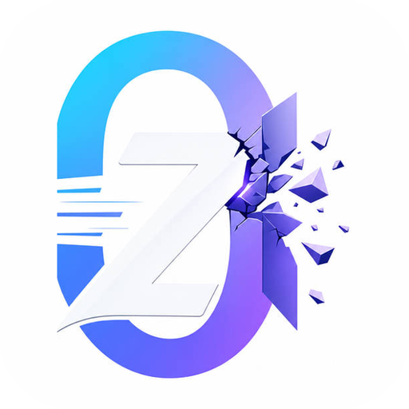
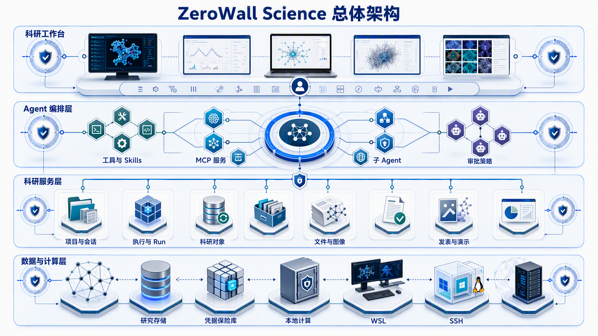
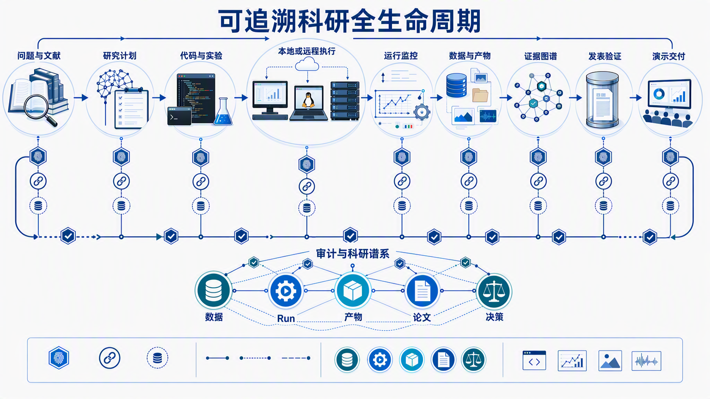

<div align="center">
  
  <h1>ZeroWall Science</h1>
  <p><strong>Local-first infrastructure for trustworthy, agent-assisted scientific research</strong></p>
  <p>Connect research intent, governed AI orchestration, durable computation, evidence, publication, and presentation in one recoverable workspace.</p>
  <p>
    <a href="README.md">English</a> ·
    <a href="README.zh-CN.md">简体中文</a> ·
    <a href="docs/architecture.md">Architecture</a> ·
    <a href="docs/architecture.zh-CN.md">中文架构</a>
  </p>
</div>

ZeroWall Science is a model-agnostic scientific research workbench built with Electron, React, TypeScript, a pinned DeepSeek Harness (DSH) runtime, 22 first-party domain plugin packages, the Better Sidebar Office integration, and an independent SQLite research store. It is designed for researchers who need AI assistance without surrendering control over project data, credentials, execution environments, or the provenance of scientific outputs.

The core idea is simple but demanding: an AI answer is not yet a research result. A trustworthy research system must preserve how a question became a plan, which tool or model acted, where code ran, what data entered, what artifact was produced, which decision followed, and how the result reached a paper or presentation.

## Product View


The workspace combines project-scoped conversations, searchable sessions, configurable models, scientific Skills, MCP services, local and remote execution, research records, reviewer findings, files, figures, publications, and presentations. The UI is rendered by the DSH React shell, while privileged authority remains in the Host and Electron main process.

## What Makes It Different

- **Research state is independent from chat history.** Projects, execution contexts, data assets, runs, artifacts, papers, decisions, publications, presentations, and audit events live in a dedicated research database. Transcript compaction or replacement does not have to erase the project record.
- **Computation is durable, not a transient terminal call.** Runs persist state, local or remote process identity, heartbeats, leases, deadlines, logs, declared inputs and outputs, recovery outcomes, and harvested artifacts.
- **The model does not own enforcement.** Models may request actions, but approval, path checks, project ownership, credential resolution, and privileged execution remain outside model context.
- **Research delivery is part of the data model.** Publication and presentation are persistent state machines with frozen evidence, reproduction runs, slide revisions, generated visuals, checksums, quality metadata, and exported artifacts.
- **Methods, models, and infrastructure are separable.** Skills encode domain procedures, MCP connects services, plugins own product domains, and execution contexts span Local, WSL, and SSH resources.
- **Audit integrity is machine-checkable.** Project audit events can be exported with deterministic event hashes and a chain hash, allowing tampering or reordering to be detected.

Together these choices create one product path from intent to evidence to delivery: the model proposes actions, the Host enforces execution boundaries, the Research Store preserves facts, and the researcher makes the final judgment. ZeroWall does not treat a polished answer as a verified scientific conclusion.

## Current Scope (4.3.8)

The shipped Windows desktop is the reference distribution for this release. It includes the DSH-based Agent workspace, first-party research plugins, the Better Sidebar Office viewer for DOCX/XLSX/PPTX, PowerShell-first Windows execution, and the recoverable presentation workflow. The current presentation flow generates PPTX; older PDF artifacts remain readable for database compatibility but are not regenerated. Quality metadata is recorded for inspection and does not block a completed PPTX.

ZeroWall is local-first, not local-only: model APIs, MCP services, WSL, SSH hosts, and web resources can participate when explicitly configured. Their availability and trust remain separate from the local application.

## Innovation at a Glance

| Innovation | Problem addressed | Concrete implementation |
| --- | --- | --- |
| Dual-track conversation and research state | Project facts disappear when long transcripts are compressed | DSH sessions remain separate from the Research Store and are linked by project/session context |
| Recoverable scientific execution | Long jobs are trapped in transient terminals | Run state machine, heartbeat, lease, PID, timeout, recovery, and artifact harvesting |
| Model-independent governance | Switching models changes the security boundary | Host/store enforce approvals, path containment, project ownership, and credential references |
| Provenance from compute to delivery | Code, data, papers, and slides become disconnected files | Explicit links among DataAsset, Run, Artifact, Paper, Decision, Publication, and Presentation |
| Patchable generative delivery | One bad slide forces a full regeneration | Per-slide visual state, attachment, checksum, generation ID, and retry semantics |
| Evidence-aware review | Review feedback remains ephemeral chat text | Persisted findings with claims, evidence coverage, remediation, re-review, and gaps |

## A Typical Project Path

1. Open or create a research project and select models, Skills, MCP services, and execution contexts.
2. Ask a question in a project-scoped session; the Agent plans before invoking tools or subagents.
3. Approve side-effecting actions and persist commands, inputs, outputs, and environment facts as a Run.
4. Harvest results into SHA-256-checked Artifacts, then connect Papers, Decisions, and explicit ResearchEdges.
5. Use Reviewer to inspect evidence coverage, remediate findings, and re-review.
6. Freeze a Publication snapshot or generate a presentation; slide visuals can be previewed, retried, and patched independently.
7. Deliver a checked PPTX, research snapshot, or publication package while retaining its traceable record.

## System Overview



ZeroWall Science separates five concerns:

| Layer | Responsibility |
| --- | --- |
| Desktop security shell | Electron lifecycle, trusted origin, system integration, updates, encrypted credential vault |
| Agent and UI kernel | DSH sessions, tools, Skills, MCP, approvals, subagents, goals, workflows, React conversation shell |
| Scientific domain services | Projects, environments, execution, runs, files, research, review, images, publications, presentations |
| Research data foundation | SQLite migrations, typed records, explicit research edges, audit chain, export/import snapshots |
| Compute and artifact plane | Local PowerShell/shell, WSL, managed SSH, logs, files, generated media, PPTX and evidence bundles |

The DSH Host binds to `127.0.0.1`. A valid port is selected on first launch and stored so the renderer origin can remain stable across restarts. Electron supervises the Host process and loads the web application from that trusted local origin.

## End-to-End Research Lifecycle



A typical project can move through the following governed path:

1. A researcher opens a project and works in a project-scoped Agent session.
2. The Agent uses native tools, domain Skills, MCP services, subagents, or a structured workflow.
3. Side-effecting work crosses approval and Host policy boundaries.
4. Code runs locally, in WSL, or through a registered SSH execution context.
5. The Run Manager persists lifecycle, heartbeats, logs, timeout, process identity, and recovery state.
6. Declared outputs are harvested into Artifact records and connected to DataAssets, Papers, and Decisions.
7. Audit events and explicit ResearchEdges form a queryable evidence graph.
8. Publication can freeze a project snapshot, validate it, and launch a durable reproduction Run.
9. Presentation can generate slide visuals, preserve revision history, and assemble checked PPTX artifacts.

## Core Capabilities

| Domain | Implemented capabilities |
| --- | --- |
| Agent workspace | Sessions, tools, approvals, subagents, continuable goals, structured multi-agent workflows |
| Scientific methods | Runtime-discovered bundled, project, global, extra-path, and plugin Skills with precedence and reload |
| External integration | MCP over `stdio` or streamable HTTP, secret references, timeout, startup policy, dynamic reconciliation, and in-app Office viewing |
| Research organization | Projects, preferences, session archives, project bundles, research snapshots, graph edges, audit reports |
| Compute | Local PowerShell or `/bin/sh`, Windows WSL, OpenSSH contexts, probes, managed transfers |
| Durable runs | State machine, PID/remote PID, logs, heartbeat, lease, timeout, cancel, pause/resume, startup recovery, harvest |
| Scientific files | Content-addressed attachments, SHA-256 verification, session authorization, PDF/Office/table/text parsing |
| Images | AI image generation/editing with actual size/quality metadata, durable attachments, offline perceptual duplicate scanning |
| Review | Persistent reviewer reports, evidence coverage, severity, remediation, re-review and coverage-gap records |
| Publication | Draft/frozen/validating/ready/failed lifecycle, frozen snapshot, validation, reproduction Run, export |
| Presentation | Outline, style, generated slide visuals, bounded concurrency, page patching, revisions, quality metadata, PPTX |
| Security | Sandboxed renderer, context isolation, loopback Host, typed DTOs, safeStorage vault, private child IPC |

## Repository Structure

```text
desktop/       Electron main process, preload, runtime supervision, security, updater and packaging
plugins/       22 first-party ZeroWall domain plugin packages plus a separate presentation runtime
store/         SQLite research domain, migrations, audit chain, snapshots and project bundles
deepseek-harness/    Pinned DSH fork providing Agent, session, tool, Skills, MCP and React UI kernels
resources/     Bundled scientific Skills, runtimes, environments, brand assets and licenses
tools/         Plugin generation, DSH verification, packaging, release and security automation
tests/         Contract, security, integration, packaging and end-to-end checks
docs/          Detailed bilingual architecture and generated architecture visuals
```

## Development on Windows

### Requirements

- Node.js `24.9.0`
- pnpm `11.7.0`
- Windows 10/11 for Windows packaging and WSL execution support
- Git with submodule support

### Setup

```powershell
git clone --recurse-submodules https://github.com/ccfwwm/zerowallscience.git
Set-Location zerowallscience
pnpm install --frozen-lockfile
pnpm dev
```

If the repository was cloned without submodules:

```powershell
git submodule update --init --recursive
```

### Quality Gates

```powershell
pnpm typecheck
pnpm test
pnpm package:dir
```

Changes to the shipped DSH/Agent composition must also pass:

```powershell
pnpm test:dsh:alpha5
```

The automated suite is intentionally designed to run without real SSH hosts, WSL distributions, GPUs, API keys, or network access.

## Packaging

```powershell
# Windows Preview package
pnpm package:win

# Windows Stable package
pnpm package:stable:win

# macOS packages require matching macOS hardware or runners
pnpm package:mac:x64
pnpm package:mac:arm64
```

Preview and Stable builds use separate application identities, user-data directories, and update channels. Build and release controls are documented in [BUILD.md](BUILD.md).

## Security and Scope

Do not commit API keys, tokens, passwords, private keys, unpublished data, or local `.env` files. The renderer is sandboxed and does not receive general Node.js or secret access. Credential values are protected through Electron `safeStorage` and resolved to the Host over private child IPC.

These controls reduce accidental exposure and keep privileged decisions outside the model and UI. Windows defaults to PowerShell/pwsh and Windows paths; WSL, SSH, and Unix shells are enabled only when the corresponding execution context is selected. ZeroWall does not claim that arbitrary user-approved code is safely sandboxed. Untrusted code requires a suitable operating-system account, container, virtual machine, network boundary, or remote isolation environment.

## Detailed Documentation

The [full architecture document](docs/architecture.md) covers:

- runtime startup and stable loopback-origin behavior;
- Electron/Host/Renderer trust boundaries;
- all plugin domains and their ownership;
- the complete research object model and seven schema migrations;
- hash-chained audit reports;
- Run recovery, leases, heartbeats, output harvesting and transfer behavior;
- file attachment authorization and integrity checking;
- Agent, Skills, MCP and multi-agent orchestration;
- publication and presentation state machines;
- innovation analysis, limitations and design tradeoffs.

## License

Copyright (C) 2026 ZeroWall Science contributors.

ZeroWall Science first-party code is licensed under [GNU AGPL-3.0-only](LICENSE). Bundled and referenced third-party components remain under their respective licenses; see [THIRD_PARTY_NOTICES.md](THIRD_PARTY_NOTICES.md).

- Website: [zerowallscience.org](https://zerowallscience.org/)
- Source: [github.com/ccfwwm/zerowallscience](https://github.com/ccfwwm/zerowallscience)
