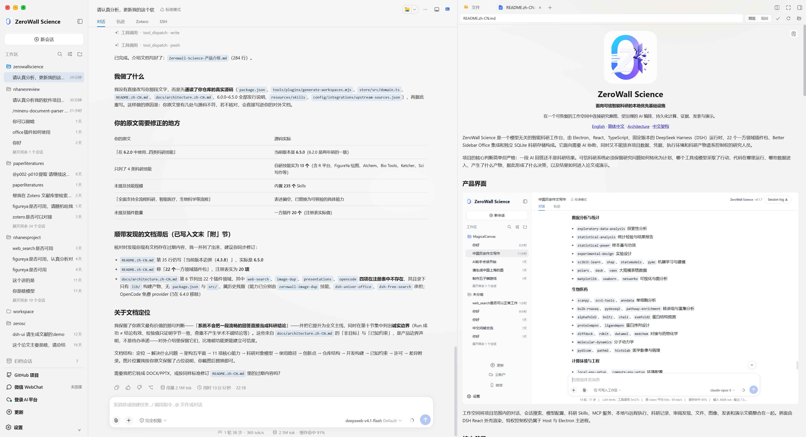

# ZeroWall Science 4.3.4

[English](README.md) | [简体中文](README.zh-CN.md)

[ZeroWall Science](https://zerowallscience.org/) 是基于 Electron、React、TypeScript 和固定 DSH Host 构建的本地优先、模型无关科研工作台。项目通过明确的本地安全边界管理项目、科研记录和凭据，并为科研执行、成果发表和演示文稿提供一体化 Agent 工作空间。



## 核心能力

- DSH Agent、会话、工具、Skills、MCP、子 Agent 和审批工作流。
- 持久化的 `Project`、`ExecutionContext`、`DataAsset`、`Run`、`Artifact`、`Paper` 和 `Decision` 记录。
- Local、WSL 和 SSH 执行环境，以及跨重启 Run Manager；WSL 仅在 Windows 上提供。
- 科学文件预览、发表证据、研究图谱和可恢复的演示文稿工作流。
- 本地优先存储：科研 SQLite 数据库与操作系统凭据保险库相互独立。
- Electron Renderer 启用沙箱和上下文隔离，不开放 Node.js integration，仅访问回环地址上的 Host。

## 架构

ZeroWall 自有 Host/Client 插件负责产品领域能力。DSH 是唯一的 Agent、会话、工具、Skills、MCP、审批、插件和 React UI 内核。科研记录与 DSH 会话持久化相互独立；凭据通过 Electron `safeStorage` 保存，不进入 Renderer 状态、SQLite、日志或导出文件。

固定的 DSH 源码以 Git 子模块形式位于 `dsh/source`。上游身份、ZeroWall fork 提交和版本记录在 `dsh/lock/upstream.json`。

## 环境要求

- Node.js 24.9.0
- pnpm 11.7.0
- Windows 打包需要 Windows 10/11
- macOS 打包、签名、公证和启动验证必须使用匹配架构的 macOS runner

## 安装与开发

```powershell
git clone --recurse-submodules https://github.com/ccfwwm/zerowallscience.git
cd zerowallscience
pnpm install --frozen-lockfile
pnpm dev
```

如果克隆时没有包含子模块：

```powershell
git submodule update --init --recursive
```

## 验证

开发时先运行针对性测试，提交前运行完整仓库门槛：

```powershell
pnpm typecheck
pnpm test
pnpm package:dir
```

涉及 Agent 组合的修改还必须运行：

```powershell
pnpm test:dsh:rc2
```

自动化测试不依赖真实 SSH、WSL、GPU、API Key 或网络访问。

## 打包

```powershell
# Windows Preview 通道
pnpm package:win

# Windows Stable 通道
pnpm package:stable:win

# 仅在对应 macOS runner 上执行
pnpm package:mac:x64
pnpm package:mac:arm64
```

Preview 与 Stable 使用不同的应用标识、数据目录和更新通道。详细说明见 [BUILD.md](BUILD.md)、[架构文档](docs/dsh-architecture.md) 和[发布通道文档](docs/release-channels.md)。

## 安全

不要提交 API Key、Token、密码、私钥、科研数据或本地 `.env` 文件。外部命令、删除、安装和远程操作仍受显式审批边界控制。提交 Issue 前请先遮盖敏感信息。

## 许可证

Copyright (C) 2026 ZeroWall Science contributors.

ZeroWall Science 第一方代码使用 [GNU AGPL-3.0-only](LICENSE) 许可证。内置和引用的第三方组件继续使用各自许可证，详见 [THIRD_PARTY_NOTICES.md](THIRD_PARTY_NOTICES.md)。

- 官网：[zerowallscience.org](https://zerowallscience.org/)
- 源码：[github.com/ccfwwm/zerowallscience](https://github.com/ccfwwm/zerowallscience)
