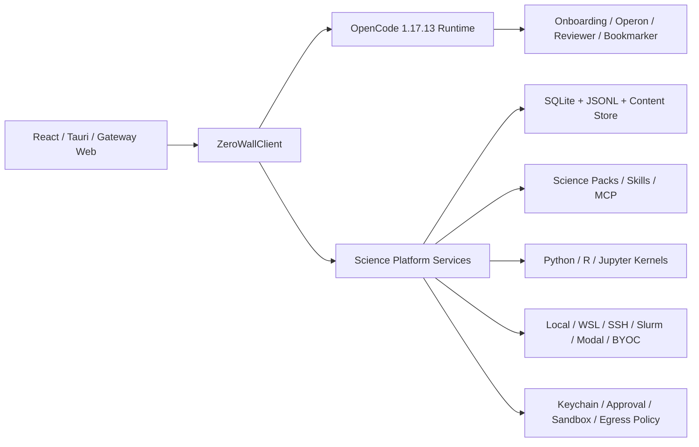

# ZeroWall Science（科研无界）完整改造实施计划

> **供 Agent 使用：** 实施本计划时必须使用 `superpowers:subagent-driven-development`（有子 Agent 时）或 `superpowers:executing-plans`，按阶段建立独立 `codex/<phase>` 分支。所有功能遵循 TDD：先写失败测试并确认 RED，再写最小实现，最后运行阶段验收。

**目标：** 构建 **ZeroWall Science（科研无界）**，品牌口号为 **“ZeroWall: Science Without Walls.”**，形成一个本地优先、国产模型优先、模型无关、可复现、可审查、可扩展的科研工作台，首发覆盖通用科研底座和生命科学旗舰能力。

**架构：** 以 Open Science Desktop `ab2853f` 为唯一桌面、Web Gateway、SDK 和 OpenCode runtime 基线。Wisp、Claude Science、OpenClaudeScience 与 Rakserver 资产只能通过稳定的 Pack、Skill、MCP、Kernel、Compute 和 Platform Service 接口适配，不得并行引入第二套前端或 Agent runtime。

**技术栈：** Tauri 2、Rust、React 18、TypeScript、Vite、Tailwind、Radix UI、OpenCode 1.17.13、SQLite、JSONL、Python/R/Jupyter、MCP、Git/Git LFS。

---

## 1. 固定范围与非协商约束

- 产品名：`ZeroWall Science`；中文名：`科研无界`。
- 产品口号：`ZeroWall: Science Without Walls.`
- 应用标识：`com.zerowall.science`。
- 包命名空间：`@zerowall/*`。
- 工作区元数据目录：`.zerowall/`。
- OpenCode 是唯一默认 Agent runtime，固定版本 `1.17.13`；UI 只能通过 `packages/sdk` 访问 runtime。
- Desktop、macOS、Windows、Linux 和 Gateway Web 共享 DTO 与业务边界；Web 不可用能力必须隐藏。
- 应用内部科研 workspace 只做本地 Git 初始化和 best-effort commit，永不自动设置 remote 或 push。
- Desktop 默认只允许访问当前 workspace。
- 命令执行、删除、依赖安装和远程连接默认需要审批；禁止发布 `off` 审批模式。
- API Key、OAuth token、SSH 密码等 Secret 只能持久化到 OS keychain/credential manager。
- SQLite、JSON、JSONL、日志、崩溃报告、provenance 和导出包只能保存 `secret_ref`。
- 主模型网关：`https://code.aicodeme.cn`。
- 备用模型网关：`https://code.aicodeme.xyz`。
- 仅网络错误、超时和 5xx 允许自动切换；401、403、余额不足、参数错误不能切换掩盖。
- 首发模型优先级：Kimi、GLM、DeepSeek；模型 ID 必须通过 `/models` 探测后显式绑定。
- 用户提供的 Wisp、Claude Science、OpenClaudeScience、CScience 和 `myscience/assets` 按已授权输入处理，但仍保留来源 commit、SHA-256、修改记录和第三方 NOTICE。

## 2. 已确认的输入基线

| 来源 | 本地路径 | 固定快照 |
|---|---|---|
| Open Science Desktop | `C:\softworks\gpt-tools\open-science` | `ab2853ff8cc8` |
| Wisp Science | `C:\softworks\gpt-tools\wisp-science` | `da2eee43d8e6` |
| OpenClaudeScience | `C:\softworks\gpt-tools\OpenClaudeScience` | `4a5f2ab2879e` |
| CScience wrapper/diagnostics | `C:\softworks\gpt-tools\cscience` | `8da55b001a8b` |
| Claude Science 0.1.25 assets | `C:\softworks\gpt-tools\myscience\assets` | 940 files，约 101.5 MB |
| Rakserver runtime 对照 | `C:\softworks\gpt-tools\cscience\diagnostic-latest-runtime\assets\skills` | 与线上最新检查结果对照 |

更新来源前必须记录旧/new commit、文件数量、总大小和 SHA-256 清单，不得静默替换快照。

## 3. 目标架构



### 3.1 目标目录

```text
apps/desktop/
packages/{sdk,shared,ui}/
runtime/
  agents/
  packs/
  connectors/
  kernels/
  compute/
  sandbox/
  marketplace/
  manager/
  opencode-profile/
  mcp/
  skills/
vendor/
  claude-science/0.1.25/
  wisp/
examples/
  crispr-screen/
  enzyme-engineering/
  extremophile/
  immunotherapy/
```

### 3.2 核心公开接口

```ts
export interface ZeroWallClient {
  runtime: OpenCodeClient;
  science: SciencePlatformClient;
}

export type ModelRole =
  | "research" | "planning" | "code" | "review"
  | "vision" | "retrieval" | "utility";

export interface RoleModelBinding {
  role: ModelRole;
  providerId: string;
  modelId: string;
  endpointId?: string;
}

export interface KernelBackend {
  start(input: KernelStartInput): Promise<KernelHandle>;
  execute(input: KernelExecuteInput): AsyncIterable<KernelEvent>;
  interrupt(handle: KernelHandle): Promise<void>;
  reset(handle: KernelHandle): Promise<void>;
  shutdown(handle: KernelHandle): Promise<void>;
}

export interface ComputeProvider {
  probe(input: ComputeProbeInput): Promise<ComputeProbe>;
  create(input: ComputeCreateInput): Promise<ComputeTarget>;
  submit(input: ComputeSubmitInput): Promise<ComputeJob>;
  wait(job: ComputeJob): AsyncIterable<ComputeEvent>;
  probeMany(ids: string[]): Promise<ComputeProbe[]>;
  reconcile(job: ComputeJob): Promise<ComputeJob>;
  terminate(job: ComputeJob): Promise<void>;
  download(job: ComputeJob): Promise<ArtifactVersion[]>;
}
```

必须新增并版本化：

- `SciencePackManifestV1`
- `AgentDefinitionV1`
- `RoleModelBinding`
- `KernelBackend`
- `ComputeProvider`
- `ArtifactVersion`、`ArtifactEdge`、`ProvenanceRef`
- `MemoryRecord`、`AnnotationTarget`
- `Claim`、`VerificationCheck`、`Resolution`

Desktop Tauri commands 与 Gateway `/api/v1/*` 必须使用同一套 DTO。

## 4. Agent 与模型体系

### 4.1 四个产品级 Agent

- **ONBOARDING**：最多提出四个科研画像问题，生成三个可执行任务，声明所需权限，然后 handoff 给 OPERON。
- **OPERON**：默认科研 Agent；Artifact-first；按需发现 Skills/MCP；必须回读执行结果并写 provenance。
- **REVIEWER**：只读 transcript、execution log 和 artifacts；生成 claim/check/evidence/resolution；不得直接修改科研结果。
- **BOOKMARKER**：每个检查点提取 0–2 个可定位原文片段，统一写入 Annotation 系统。

### 4.2 七个显式模型槽位

`research`、`planning`、`code`、`review`、`vision`、`retrieval`、`utility`。

每个 Session 创建时固化完整模型快照，包括 provider、model、endpoint、参数、fallback 策略和探测时间。禁止隐藏模型路由。

## 5. Science Pack 与资产融合

### 5.1 Wisp 42 Skills Catalog

| Pack | Skills |
|---|---|
| Core Research | `agent-infini`、`customize`、`product-self-knowledge`、`self-awareness` |
| Life Science | `alphafold2`、`boltz`、`borzoi`、`chai1`、`diffdock`、`esmfold2`、`evo2`、`fair-esm2`、`ligandmpnn`、`openfold3`、`proteinmpnn`、`scgpt`、`scvi-tools`、`solublempnn`、`indication-dossier` |
| Literature & Evidence | `literature-review`、`pdf-explore`、8 个 `bear-*` |
| Figure & Publishing | `figure-composer`、`figure-style`、`paper-narrative`、`journal-club-ppt` |
| Compute | `compute-env-setup`、`local-env-setup`、`probe-compute-environment`、`remote-compute-ssh`、`remote-compute-modal` |
| Browser & Retrieval | `browser-use` |
| Model Endpoint | `managed-model-endpoints`、`using-model-endpoint` |
| Skill Authoring | `skill-creator` |

### 5.2 生命科学 MCP

- 目标：23 个领域组、247 个工具、一个聚合入口。
- 覆盖文献、临床试验、基因组、变异、表达、组学、蛋白、结构、相互作用、化学、药物、监管。
- 所有 tool schema 必须可解析，名称不能冲突。
- 空查询条件必须拒绝，不能退化为全表查询。
- OpenAlex Key 必填场景要区分 401/403，并对日志脱敏。
- TLS 只能使用连接器级 `SSLContext`，不能修改进程全局 TLS。
- 公共无 Key 工具必须在未配置 Secret 时可运行。

### 5.3 其他资产

- Ketcher 支持 SMILES/Molfile/KET/RXN 2D 编辑，与现有 3Dmol 双向跳转。
- OpenClaudeScience 适配 patent disclosure、DOCX/PDF/PPTX/XLSX 科研发布、图片压缩、科研图文和文档代理。
- 不引入 LangGraph 第二 runtime；文档代理改造成 OpenCode Skill/Platform Service。
- Wisp ACP、动态委派、Specialist、浏览器扩展、WSL/SSH Context、Research Graph、项目导入导出和加密同步，通过 OpenCode tool 或 Platform Service 接入。
- `web-dist` 只用于行为对照，不进入应用前端构建。
- `sharp-runtime`、micromamba、seccomp 按平台打包，禁止跨平台误用 Linux 二进制。

## 6. 数据与持久化

干净基线只保留 M000–M008，不复制 Claude Science 历史补丁：

| Migration | 范围 |
|---|---|
| M000 | schema metadata、UUID、timestamps、FK、事务规则 |
| M001 | projects、sessions、messages、events |
| M002 | artifacts、versions、edges、executions、content snapshots、provenance refs |
| M003 | secret refs、approval decisions、resource grants |
| M004 | agents、skills、MCP、assignments、tool policies、marketplace sources |
| M005 | memories、compaction archives、annotations、bookmarks、read marks |
| M006 | claims、verification checks、reviewer runs、resolutions |
| M007 | message queue、session concurrency、routine schedules、leases |
| M008 | compute providers/jobs/usage、termination queue、managed endpoints、egress policy |

耐久事实边界：

- Workspace 文件、local Git、append-only JSONL：科研事实和可复现记录。
- SQLite：关系、索引、队列、审批、运营状态。
- `.zerowall/store/sha256/`：内容寻址大对象。
- OS keychain：全部 Secret 原值。

## 7. 分阶段实施计划

### P0：仓库与品牌基线

**状态：已完成。**

**关键文件：** `AGENTS.md`、`package.json`、`pnpm-workspace.yaml`、`apps/desktop/src-tauri/tauri.conf.json`、`scripts/check-brand-contract.mjs`。

- [x] 从 Open Science Desktop `ab2853f` 建立全新 Git 历史。
- [x] 排除原 `.git`、`node_modules`、`dist`、缓存、Secret 和本机构建产物。
- [x] 完成品牌、bundle、package、workspace metadata 迁移。
- [x] 保留旧 bundle/workspace 的安全导入兼容。
- [x] 品牌契约、前端、Rust 和构建基线通过。

### P1A：数据底座

**状态：已完成并提交。**

**关键文件：** `apps/desktop/src-tauri/src/science_db.rs` 与 `apps/desktop/src-tauri/migrations/M000__metadata.sql` 至 `M008__compute_egress.sql`。

- [x] Workspace 启动/切换初始化 `.zerowall/science.db`。
- [x] 9 个事务迁移、40 张表、SQL 指纹和结构漂移校验。
- [x] WAL、FK、5 秒 busy timeout。
- [x] 复合 scope FK、lease 互斥、Artifact 旧内容恢复、SHA-256 约束。
- [x] symlink/Windows reparse 防护。

### P1B：Keychain-only 与安全迁移

**状态：进行中。断点见 `docs/ZEROWALL_IMPLEMENTATION_STATUS.md`。**

**关键文件：**

- Create: `apps/desktop/src-tauri/src/secret_store.rs`
- Modify: `apps/desktop/src-tauri/src/runtime.rs`
- Modify: `apps/desktop/src-tauri/src/lib.rs`
- Modify: `apps/desktop/src-tauri/Cargo.toml`
- Modify: `apps/desktop/src/lib/tauri.ts`
- Modify: `apps/desktop/src/app/routes/SettingsPage.tsx`
- Modify: `apps/desktop/src/lib/setup.ts`
- Modify: `apps/desktop/src/lib/scienceConnectors.ts`
- Modify: `runtime/opencode-profile/README.md`

- [ ] 实现 `import_auth_document`，完整校验后事务式写入 Keychain reference。
- [ ] 实现 `plan_legacy_config_migration`，提取 Provider `apiKey`、敏感 MCP environment/header。
- [ ] startup 迁移旧 `auth.json` 和 `opencode.json/jsonc`；失败时保留原文件并 fail closed。
- [ ] `import_opencode_login` 改为解析 CLI auth 后写 Keychain，不复制文件。
- [ ] `spawn_sidecar` 始终注入 `OPENCODE_AUTH_CONTENT`；无凭据时注入 `{}`。
- [ ] Connector Secret 注入 sidecar process env。
- [ ] Provider 保存/删除只调用 Tauri Keychain command。
- [ ] Custom Provider 和 Connector 配置不得包含 Secret 原值。
- [ ] 隐藏 OpenCode 内置 OAuth callback UI，直到能直接写 Keychain。
- [ ] 增加 SQLite、JSON、JSONL、日志、export 的 Secret 扫描测试。
- [ ] 更新 OpenCode profile 文档。

**验证：**

```powershell
pnpm --filter @zerowall/desktop test
pnpm --filter @zerowall/desktop typecheck
pnpm --filter @zerowall/desktop lint
pnpm --filter @zerowall/desktop build
pnpm test:brand

$env:TAURI_CONFIG='{"app":{"macOSPrivateApi":true}}'
cargo test --lib --manifest-path apps/desktop/src-tauri/Cargo.toml
cargo clippy --all-targets --manifest-path apps/desktop/src-tauri/Cargo.toml
cargo build --manifest-path apps/desktop/src-tauri/Cargo.toml
```

### P2：ZeroWallClient、Agent 与国产模型

**文件：** Create `packages/sdk/src/ZeroWallClient.ts`、`SciencePlatformClient.ts`、`packages/shared/src/models.ts`、`agents.ts`、`runtime/agents/*.json`；Modify Settings 与 runtime store。

- [ ] 定义并测试 `ZeroWallClient` 组合边界。
- [ ] 定义 `AgentDefinitionV1` JSON Schema。
- [ ] 实现四 Agent、权限策略和可追踪 handoff。
- [ ] 定义七个 `RoleModelBinding` 槽位。
- [ ] 通过 `/models` 探测 Kimi/GLM/DeepSeek。
- [ ] 实现主/备用网关分类 fallback。
- [ ] Session 创建时固化模型快照。
- [ ] Sub2API 登录可跳过；本地模式无需账号。
- [ ] Gateway 按 tenant 隔离 workspace/runtime/session/credentials。

**验收：** 四 Agent handoff 可回放；路由完全可见；非网络错误不 fallback；多用户不共享进程级 Secret。

### P3：Science Pack、Catalog 与 Marketplace

**状态：Phase 1 完成（2026-07-26）。** 详见 `docs/P3_IMPLEMENTATION_SUMMARY.md`。

**文件：** Create `packages/shared/src/science-pack.ts`、`runtime/packs/schema/v1.json`、`runtime/packs/*/manifest.yaml`、`runtime/marketplace/*`、`runtime/connectors/registry.ts`。

- [x] 定义 `SciencePackManifestV1` 和 contract tests。
- [ ] 支持安装、启停、升级、回滚和来源 SHA 校验。
- [ ] 支持 Skill/MCP/Agent 分配和工具策略。
- [x] 生成 42 个 Wisp Skill manifest。
- [x] 保留 source repo/commit/path/SHA/modified。
- [ ] 大型资产和原始快照使用 Git LFS。
- [ ] 发布包只打包当前平台资源。

**验收：** 42 Skills 精确枚举 ✅；Pack 可独立禁用（manifest 字段就绪）✅；manifest 可解析 ✅；无重复 ID ✅。

### P4：生命科学旗舰与 23 组 MCP

**文件：** Create `runtime/connectors/life-science/*`、`runtime/packs/life-science/manifest.yaml`、`KetcherEditor.tsx`；Modify MoleculeView 与 connector catalog。

- [ ] 建立 23 个领域组和 247 tools 固定 registry。
- [ ] 对 Rakserver 行为建立 contract fixtures。
- [ ] 修复空条件查询、OpenAlex Key/401/403 和脱敏日志。
- [ ] 为每个连接器建立独立 TLS context。
- [ ] 适配生命科学模型工作流 Skills。
- [ ] 集成 Ketcher 2D 与 3Dmol 双向跳转。
- [ ] 建立无 Key 公共工具 smoke tests。

**验收：** 数量 contract、schema、tool name、公共工具、空条件/OpenAlex/TLS 全部通过。

### P5：Kernel、Compute 与 Sandbox

**文件：** Create `runtime/kernels/*`、`runtime/compute/*`、`runtime/sandbox/*`；Modify Rust `kernel.rs`、`compute.rs`。

- [ ] 实现统一 `KernelBackend`。
- [ ] 支持 `stdout_chunk/figure/result/error/resource_usage`。
- [ ] 支持跨 Cell 状态、interrupt、timeout、reset、崩溃恢复。
- [ ] 协议 stdout 与用户 stdout 分离。
- [ ] 实现统一 `ComputeProvider` 生命周期。
- [ ] 建立 local/SSH/Slurm/Modal/BYOC fake provider tests。
- [ ] 实现 15 分钟 resident idle、stage 路径、10 GiB 上限、批量轮询和结果回收。
- [ ] Linux seccomp 与 Windows/macOS 平台沙箱适配。

### P6：Reviewer、Memory、Annotation 与 Research Graph

**文件：** Create `packages/shared/src/{review,memory,annotations}.ts` 和对应 UI/service；Modify `science_db.rs`。

- [ ] 实现 Claim/Check/Evidence/Resolution 状态机。
- [ ] Reviewer 只读运行，finding 支持 resolve/reopen。
- [ ] Bookmarker 写统一 Annotation。
- [ ] Memory 支持禁用、删除、compaction archive。
- [ ] Research Graph 连接 Artifact DAG、Claims、Annotations 和 provenance。
- [ ] 所有证据定位到 Artifact version、message 或 execution。

### P7：Control Plane、UX 与示例

**文件：** Modify `apps/desktop/src/app/routes/*`；Create Control Plane components 与四个 examples。

- [ ] 完成 Control Plane、Compute、Memory、Provenance、Notes。
- [ ] Gateway Web 隐藏 native-only 控件。
- [ ] 验证 390px 手机宽度。
- [ ] 将四个 Claude 示例改成固定种子、可重跑 workflow 和黄金结果。
- [ ] 增加 Biomni 风格任务集。
- [ ] 比较完成率、证据覆盖、Artifact 完整性、成本、耗时。

### P8：发布、GitHub 与部署

**文件：** Modify `.github/workflows/*`、release scripts、Tauri config；Create `.gitattributes`。

- [ ] Windows/macOS/Linux CI 和签名安装包。
- [ ] Git LFS pointer 校验。
- [ ] Gateway tenant isolation、WebSocket、健康检查和回滚。
- [ ] 确认 `ccfwwm/zerowallscience` 不存在或为空。
- [ ] 全部发布门通过后创建 private repository 并推送 `main`。
- [ ] 启用 Actions、Secret scanning 和分支保护。
- [ ] 部署 `zerowall.aicodeme.cn` 和 `zerowall.aicodeme.xyz`。

仅在 P8 验收后执行：

```powershell
gh repo create ccfwwm/zerowallscience --private --source . --remote origin
git push -u origin main
```

## 8. 测试矩阵

- **单元：** manifest/schema、模型角色、Secret 脱敏、Artifact DAG、claim 状态机、队列租约、连接器校验。
- **Contract：** 42 Skills、23 MCP groups、247 tools、schema 解析、tool name uniqueness。
- **Kernel：** 跨 Cell、stdout chunk、输出上限、Matplotlib、错误行号、interrupt、timeout、crash recovery。
- **Compute：** fake local/SSH/Slurm/Modal/BYOC、终止、reconcile、download。
- **安全：** traversal/symlink/reparse、审批、tenant isolation、Secret 扫描、egress allowlist。
- **E2E：** 新建项目、国产模型、文献、生命科学、Notebook、2D/3D 分子、Reviewer、导出、Gateway 手机。

## 9. 每阶段通用工作流

- [ ] 从最新 `main` 创建 `codex/<phase>`。
- [ ] 阅读 `AGENTS.md`、本计划和状态文档。
- [ ] 建立可验证的窄目标。
- [ ] 先写失败测试并确认 RED。
- [ ] 写最小实现并确认 GREEN。
- [ ] 运行全量 tests、typecheck、lint、build、Clippy。
- [ ] 扫描 Secret、二进制、缓存和意外大文件。
- [ ] 在 `PROGRESS.md` 顶部添加一个真实里程碑。
- [ ] 小粒度提交，不混入无关格式化。
- [ ] 进入下一阶段前完成代码审查。

## 10. 首发完成定义

- P0–P8 全部验收门通过。
- Desktop 三平台安装成功。
- Gateway 主/备用域名健康。
- 租户隔离和 Secret 扫描通过。
- 42 Skills、23 MCP groups、247 tools contract 通过。
- 四个示例和 Biomni 风格任务集可重跑。
- 升级和回滚演练通过。
- GitHub repository 为 private，分支保护和 Secret scanning 已启用。
- 当前工作树干净，全部提交可追溯。

