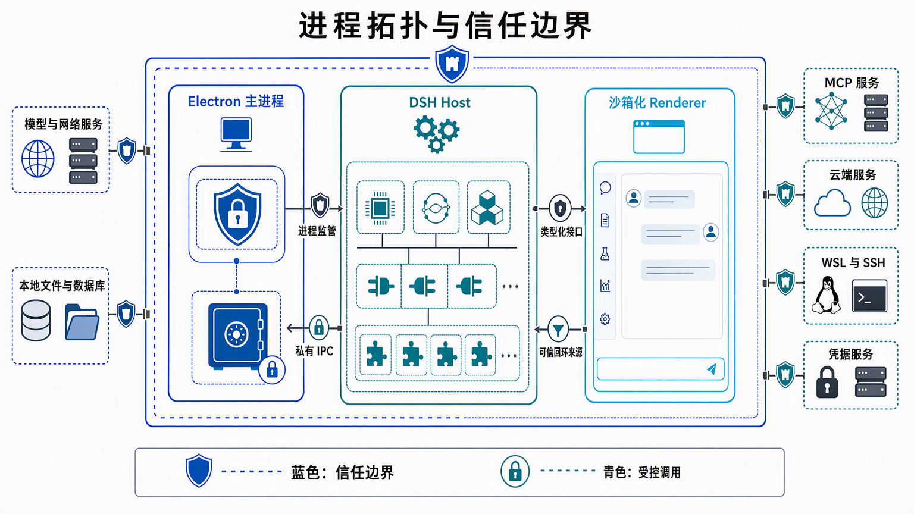
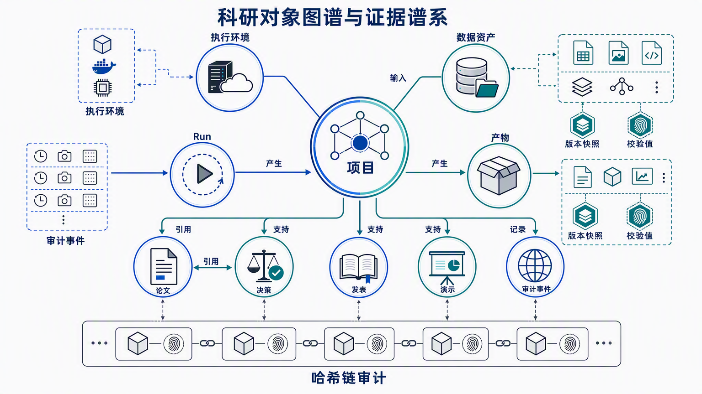
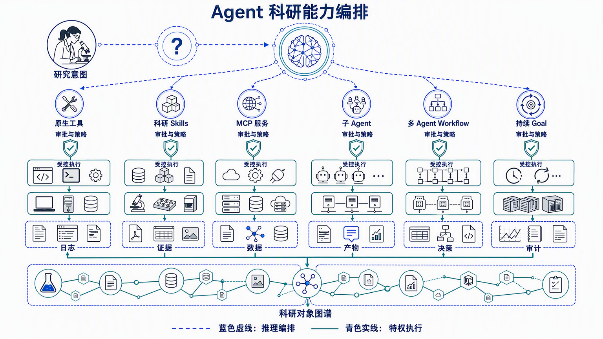
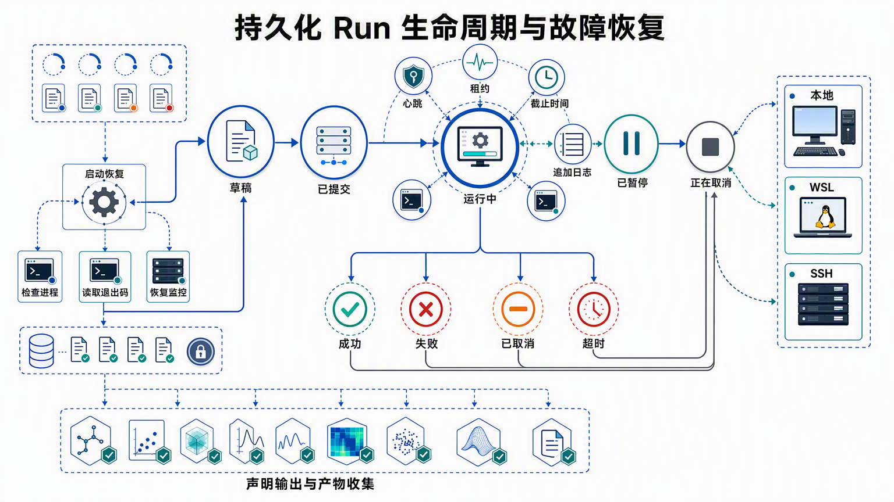
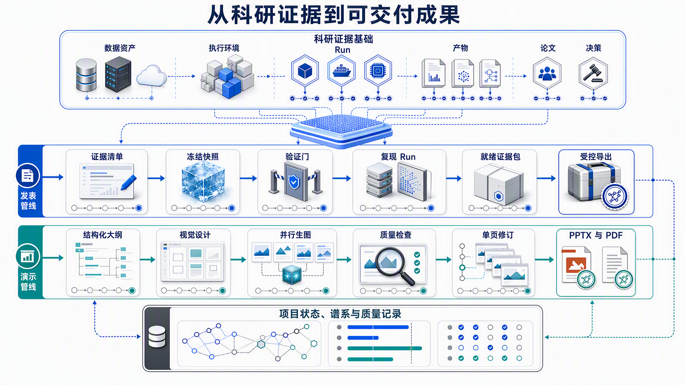

# ZeroWall Science 技术架构

[English](architecture.md) | [简体中文](architecture.zh-CN.md) | [项目 README](../README.zh-CN.md)

<div align="center">
  
</div>

ZeroWall Science 是面向 Agent 辅助科研的本地优先控制平面。它整合对话推理、受治理的工具调用、异构计算、项目范围内的科研记录、证据审阅、发表验证和演示文稿生成。整个架构旨在保持从研究意图到最终科研成果之间的权限边界、可恢复状态和可追溯关系。

本文以当前源码树为依据，描述已经强制执行的控制、持久化状态、运行行为、已知限制，以及 ZeroWall Science 区别于“以对话记录为中心”的 AI 桌面应用的设计选择。

### 阅读指南

第 3-6 节说明进程所有权和插件边界；第 7-15 节说明科研数据、执行、文件、图像和审阅的持久化机制；第 16 节跟踪发表与 PPTX 交付；第 17-22 节说明安全、创新、构建、保留策略、约束和演进。文中明确写出的限制是产品边界，而不是尚未兑现的承诺。本文描述已交付的 4.3.8 架构：演示流程生成 PPTX，历史 PDF 记录仍可兼容读取。

## 1. 产品上下文


产品提供连续的科研工作空间：

- 项目范围内的 Agent 对话和可搜索会话历史；
- 可配置模型提供方和账户托管模型路由；
- 可复用科研 Skills 与 MCP 服务；
- Local、WSL 和 SSH 执行环境；
- 持久化 Run、日志、进度、取消、恢复和产物收集；
- DataAsset、Artifact、Paper、Decision、ResearchEdge 和审计报告；
- 科研文件预览、图像生成/编辑和离线图片查重；
- 持久化审阅发现、发表工作流和演示文稿生成。

界面被有意设计为不承担安全或状态正确性的权威职责。它负责呈现 Host 的类型化状态和提交请求；所有权检查、路径验证、凭据、进程控制和持久化均在 Renderer 边界之外执行。

## 2. 设计目标与非目标

### 2.1 设计目标

1. **连续性**：从问题提出到计算和成果交付始终保留项目上下文。
2. **显式执行**：直接表示环境、命令、输入、输出、日志、进程身份和终止状态。
3. **证据可追溯**：通过项目范围内的类型化关系和审计事件连接科研实体。
4. **本地控制**：项目元数据和凭据默认保留在用户明确控制的边界内。
5. **模型可迁移**：模型提供方的选择不决定安全或持久化模型。
6. **方法可迁移**：可复用科研过程与模型、基础设施相互解耦。
7. **可恢复性**：保存足够状态，用于诊断或恢复长期计算与生成式交付任务。
8. **诚实验证**：区分校验值、本地复现、审阅发现和人工评审，不把它们合并成一个笼统的“正确性”结论。

### 2.2 非目标

- ZeroWall 不是用于任意恶意代码的强化沙箱。
- Run 成功不代表科学结论有效。
- 校验值证明字节一致性，不证明语义正确性。
- 复现 Run 不证明所有未捕获外部依赖完全相同。
- AI 生成的图片、审阅、文本和幻灯片仍需合格人员和领域专家评审。
- 远程 SSH 主机、模型提供方、MCP 服务和 Web 服务仍是独立信任域。

## 3. 架构总览


系统由五个相互协作的平面组成。

| 平面 | 所有职责 | 源码归属 |
| --- | --- | --- |
| 桌面安全外壳 | Electron 生命周期、可信来源、更新、原生对话框、剪贴板、凭据保险库 | `desktop/src/main`、`desktop/src/preload` |
| Agent 与 UI 内核 | 会话、工具、Skills、MCP、审批、Goal、子 Agent、Workflow、React 外壳 | `deepseek-harness` |
| 科研领域服务 | 项目、执行、Run、文件、科研、审阅、图像、发表、演示 | `plugins/*` |
| 科研数据基础 | SQLite schema、迁移、领域校验、图谱边、审计链、快照 | `store/src` |
| 计算与产物平面 | Local/WSL/SSH 进程、项目文件、日志、生成图片、PPTX 与导出 | 项目根目录、用户数据根目录、远程主机 |

关键分离发生在**对话状态**和**科研状态**之间。DSH 会话持久化记录交互历史；独立 Research Store 记录项目实体、计算、证据、交付状态和审计记录。二者互相关联，但不会被迫相互替代。

### 3.1 请求与数据流

```text
研究人员
   -> DSH React Renderer（低权限）
   -> 类型化远程 DTO / Typert codec
   -> DSH Host 插件服务
      -> 策略、所有权、路径、审批和凭据检查
      -> Research Store 事务和/或受管执行适配器
      -> 项目文件或持久化附件
      -> Artifact / AuditEvent / 进度事件
   <- 脱敏的类型化结果和界面刷新
```

箭头方向很重要。Renderer 可以发起请求，但不能把一个被界面隐藏的操作变成权限。成功响应表示 Host 校验和领域操作都已完成，并不表示模型最初的指令就是正确的。二进制输出也遵循同一路径：字节先写入授权的项目或附件根目录，计算校验值，再以类型化引用暴露给客户端。

## 4. 运行进程与信任边界



### 4.1 Electron 主进程

主进程是操作系统权限主体，负责：

- 以沙箱、上下文隔离、禁用 Node integration 和启用 web security 的方式创建 `BrowserWindow`；
- 启动、观察和终止 DSH Host 子进程；
- 拥有基于 Electron `safeStorage` 的加密凭据保险库；
- 提供最小化 preload 桥接；
- 处理原生目录选择、Windows 文件剪贴板、托盘、更新和受管 MCP 环境；
- 将导航限制在可信应用来源，普通外部链接交给系统浏览器；
- 禁止 WebView，只授权明确处理的安全剪贴板权限。

相关源码：`desktop/src/main/index.ts`、`security.ts`、`security-policy.ts`、`credentials/vault.ts` 和 `credentials/broker.ts`。

### 4.2 DSH Host 子进程

Electron 以嵌入式 Web 模式启动 DSH：

```text
web --patch <zerowall patch> --host 127.0.0.1 --port <selected port> --no-open
```

系统从有效非特权端口范围中选择端口。当配置 `portPath` 时，会优先使用先前记录的端口，使 Renderer origin 在重启后保持稳定；若该端口不可用，则选择并保存新的空闲端口。应用只有在回环就绪检查通过后才被视为可用。

Host 通过显式环境变量接收 DSH home、内置和用户 Skills、科研数据库、品牌资源和遥测禁用等根配置。Electron 负责优雅关闭和必要时的强制进程树终止。

相关源码：`desktop/src/main/runtime/harness-runtime.ts`。

### 4.3 沙箱化 Renderer

Renderer 是低权限 React 客户端，使用 DSH 对话外壳和 ZeroWall Client 插件。它不获得通用文件系统、进程、Node.js 或凭据权限。类型化远程服务将请求发送到 Host；安全判断不依赖界面是否隐藏某个按钮。

### 4.4 外部信任域

以下系统位于本地应用信任边界之外：

- 模型提供方 API；
- MCP HTTP 服务和 MCP stdio 子进程；
- SSH 主机及其文件系统；
- 软件包仓库和下载的科研环境；
- Web 资源和科研数据库。

ZeroWall 集中管理配置、凭据引用、审批和审计，但不会把外部系统转换成本地可信组件。


上图将进程架构与科研流程连接起来：研究问题进入 Agent 编排，计算经过受治理执行环境，输出转化为科研记录，最终交付产物仍与证据和审计状态保持关联。

## 5. 启动与运行时监管

启动过程是一个受控序列，而不是静态 Electron 页面：

1. Electron 解析发布通道对应的应用身份和用户数据目录。
2. 准备产品目录和兼容迁移位置。
3. 初始化 `CredentialVault`、凭据 broker、更新器、托盘和 MCP 环境控制器。
4. 解析开发或打包环境下的 DSH、插件、Skills、运行时、品牌资源和科研数据库路径。
5. `HarnessRuntime` 选择优先/空闲回环端口，并启动 DSH 子进程。
6. DSH 加载 ZeroWall patch、Host 插件、生成的 Typert codec、工具注册表、Skills、MCP 客户端和 React Client 组合。
7. Electron 等待回环就绪，再在沙箱化 Renderer 中加载可信来源。
8. 领域服务恢复未完成状态，包括动态 MCP 客户端、持久化 Run 和演示文稿生成状态。
9. 关闭时先请求 Host 协作退出，必要时升级为进程树终止。

该分离让 Electron 负责原生权限，让 DSH 负责 Agent 与产品运行时组合。

## 6. 插件系统与领域所有权

仓库包含 22 个一方领域插件包。内部演示运行时是由 `plugin-presentations` 消费的独立库，不是第二个独立加载的产品插件。因此，下表是 22 个插件领域加 1 个运行时组件。插件可以提供 Host 服务、Client 界面、共享契约、Agent 工具和测试。

| 插件领域 | 主要职责 |
| --- | --- |
| `base` | 品牌界面、更新入口、通用 Client/Host helper |
| `desktop-compat` | 桌面 profile 与兼容集成 |
| `account` | AI Cloud 账户、网关故障切换、余额、订单、托管模型发现 |
| `ai-cloud` | 模型提供方集成界面 |
| `secrets` | Host 侧凭据 broker client 和凭据引用 |
| `projects` | 项目 CRUD、最近/打开状态、偏好、会话归档与项目包导入导出 |
| `execution` | Local/WSL/SSH 环境、能力报告、探测和有界命令执行 |
| `environment` | 已配置科研运行时与环境状态 |
| `runs` | 持久化 Run、进程适配器、心跳、租约、恢复、取消和产物收集 |
| `files` | 授权上传、SHA-256 内容寻址、解析和有界读取 |
| `research` | 科研实体、边、审计报告、快照和科研预览 |
| `skills` | 用户 Skill 创建、导入、复制、删除和来源清单 |
| `mcp` | MCP 持久配置、凭据解析、动态客户端生命周期和重连 |
| `python` | 签名本地 Python 执行入口 |
| `web-search` | 当前 Web 检索工具集成 |
| `images` | 受管 AI 图像生成/编辑和附件持久化 |
| `image-dup` | 本地离线感知重复扫描和报告 |
| `reviewer` | 持久化审阅模式、发现、覆盖率和修复界面 |
| `publications` | 发表生命周期、冻结快照、复现与导出 |
| `presentations` | 项目演示记录、工具、预览和导出 |
| `presentations-runtime` | 固定的内部页面生成和 PPT 组装运行时 |
| `wechat` | 可选微信通道/会话集成 |
| `opencode` | 可选 OpenCode 集成 |

Host/Client 调用使用生成的 Typert codec 和类型化 DTO。插件 Client 界面永远不能替代 Host 授权。

## 7. 科研数据基础

### 7.1 SQLite 行为

`ResearchStore` 使用 Node SQLite，并启用：

- `PRAGMA journal_mode = WAL`；
- `PRAGMA foreign_keys = ON`；
- 有界 busy timeout；
- 有序 schema 迁移；
- 事务更新和乐观版本号。

### 7.2 七版 schema 迁移

| 迁移 | 引入状态 |
| --- | --- |
| 1 | Project 与更新时间索引 |
| 2 | 持久化 MCP 服务、transport、凭据引用、超时和重连策略 |
| 3 | ResearchNode、ExecutionContext、DataAsset、Run、Artifact、Paper、Decision、Edge、AuditEvent |
| 4 | Publication 与 Presentation |
| 5 | ProjectPreferences、Run 输入/截止时间、Publication 复现关联 |
| 6 | Presentation 产物和质量状态 |
| 7 | Presentation generation 状态和修订历史 |

迁移历史体现了架构演进：系统从项目存储逐步发展成持久化科研执行与成果交付基础。

## 8. 科研对象图谱与谱系



一等领域对象包括：

| 对象 | 关键语义 |
| --- | --- |
| `Project` | 项目标识、根路径、描述、时间戳和偏好 |
| `ExecutionContext` | `local`、`wsl` 或 `ssh`，版本化配置和项目所有权 |
| `DataAsset` | URI、位置类型、媒体类型、大小、校验值和 provenance 对象 |
| `Run` | 命令、工作目录、状态、进度、进程身份、租约、心跳、截止时间、日志、输入和输出 |
| `Artifact` | 带 URI、媒体类型、校验值、元数据和可选产生 Run 的项目产物 |
| `Paper` | 标题、DOI、URI、引用对象和笔记 |
| `Decision` | 理由和 proposed/accepted/rejected/superseded 生命周期 |
| `ResearchEdge` | 显式、项目范围内、带元数据的有向关系 |
| `Publication` | 冻结科研快照、验证、复现关联和导出状态 |
| `Presentation` | 大纲、页面状态、视觉谱系、修订历史、质量和导出产物 |
| `AuditEvent` | 项目操作、可选实体、详情和时间戳 |

`research_nodes` 为支持图谱的实体提供共同身份层。外键和项目检查阻止跨项目边。图谱关系是显式记录，不根据文件名相似度或对话措辞推断。

### 8.1 审计链完整性

审计报告包含有序事件列表、每个事件的确定性哈希、最终链哈希和 `chainValid` 结果。每个事件哈希都包含规范化事件内容和前序链状态，因此可以检测导出事件序列中的意外或未授权重排与修改。

审计链证明已记录序列内部一致，不证明现实世界中的所有操作均被完整捕获。未经过 instrumented service 的行为不会被自动记录。

### 8.2 快照与项目可迁移性

科研快照以带版本结构导出项目和全部一等科研集合。项目包可以包含项目元数据和经过校验的 DSH 会话归档。导入会验证格式/版本、会话头、哈希、路径和冲突，再发布新会话文件。

## 9. Agent 与科研能力编排



DSH 提供编排内核，ZeroWall 围绕它组合六条能力路径：

1. **原生工具**：执行项目、文件、图像、运行、演示等产品操作。
2. **Skills**：承载可复用科研方法和任务特定操作规程。
3. **MCP 服务**：通过标准协议连接外部工具。
4. **子 Agent**：隔离上下文执行聚焦任务，并向父会话返回结果。
5. **结构化 Workflow**：执行有界并行或流水线式多 Agent 编排。
6. **可续跑 Goal**：支持同一会话跨续跑轮次完成长期目标。

推理路径与特权执行相互分离。工具可以对 Agent 可见，但 Host 策略、审批、项目所有权、路径约束和凭据解析始终是权威边界。

### 9.1 Skills 目录

Skills 可以来自：

- 内置只读 Skills；
- 项目 `.zerowall/skills`；
- 用户全局 Skills；
- 配置的额外路径；
- 插件提供的 Skills。

有效目录记录优先级、遮蔽、解析错误、启用状态、scope 和 path。重新加载不需要重启桌面；空闲 Agent 在下一轮使用刷新后的索引。

### 9.2 MCP 生命周期

MCP 配置持久化：

- 唯一 server name；
- `stdio` 或 streamable HTTP transport；
- command/arguments/cwd 或 URL；
- 环境变量/请求头凭据引用；
- 工具调用超时；
- 启动失败策略；
- 重连开关、延迟和最大尝试次数。

`ZeroWallMcpService` 串行化配置变更、运行时解析凭据引用、为每个活动客户端维护 Fiber、记录错误和缺失环境引用、reconcile 创建/更新/删除状态，并在环境签名变化时周期刷新。

## 10. 执行环境

### 10.1 Local

Windows 本地命令使用 PowerShell，类 Unix 系统使用 `/bin/sh`。输出有上限，避免 Host 内存无限增长；命令必须有显式超时。

### 10.2 WSL

WSL 仅在 Windows 上可用。配置选择发行版、用户和可选环境，命令通过带显式参数的 `wsl.exe` 路由。

### 10.3 SSH

SSH 环境使用已注册 host、port、user、key/agent、连接超时和可选远程环境。执行使用非交互 OpenSSH 参数，并验证环境属于当前项目。

### 10.4 能力探测

Probe 验证当前连接并收集有界能力快照。它是某一时刻的能力证据，不是远程系统永久不变的断言。

## 11. 持久化 Run Manager



### 11.1 持久化生命周期

Run 状态为：

```text
draft -> submitted -> running -> succeeded | failed | timed_out
                              -> paused -> running
                              -> cancelling -> cancelled
```

Run 记录包含 PID、remote PID、log URI、进度、租约所有者、租约到期、心跳、超时截止、输入、输出和错误状态。

### 11.2 心跳与租约

Manager 拥有随机租约身份。默认每 10 秒续租活动状态，租约有效期为 30 秒。租约让跨恢复边界的进程所有权和过期状态变得明确。

### 11.3 启动恢复

启动时，Manager 检查 `submitted`、`running`、`paused` 或 `cancelling` 状态的 Run：

1. 确定项目执行环境。
2. 从记录或日志标记中恢复 remote PID。
3. 检查本地或远程进程是否仍存活。
4. 若存活，更新所有权并继续监控。
5. 若不存活，读取持久化退出码标记。
6. 零退出码转为成功并收集输出；非零或无法确定的退出转为明确失败。

系统不会把已经死亡的任务静默留在 running 状态。

### 11.4 控制行为

- Windows 取消使用 `taskkill.exe /T /F` 结束进程树。
- 类 Unix 本地暂停/继续使用 `SIGSTOP`/`SIGCONT`。
- Windows 本地暂停/继续明确不支持。
- 远程取消/暂停/继续针对 remote PID 使用 `kill`。
- 超时时间限制在 1 毫秒到 30 天之间。

### 11.5 产物收集

Run 成功后，声明输出 URI 可以被收集为 Artifact。产生它的 Run ID 会被保留，从而把临时输出路径转换为项目可见科研对象。

## 12. 受管文件传输架构

受管传输避免 Agent 自由生成远程复制命令。

- Local→SSH、SSH→Local 和 SSH→SSH 路由要求精确路径。
- 既有目标会被拒绝，而不是静默覆盖。
- SSH→SSH 直接路径要求已验证的有向信任边。
- 没有直接信任时，私有本地 staging relay 使用两端分别配置的凭据。
- 本地下载先进入 staging，完成后才 rename 到目标位置。
- 传输持久化为 Run，因此具备取消、超时、进度和审计记录。

A→B 与 B→A 信任彼此独立。安装信任需要审批，生成的私钥留在源主机上。

## 13. 科研文件与附件架构

上传文件不会以任意路径直接交给模型。

1. Host 接收规范 base64，并验证媒体声明。
2. SHA-256 产生内容寻址对象身份。
3. 原始字节、解析文本和元数据存储在 DSH attachment root 下。
4. PDF、DOCX、PPTX、XLSX、JSON、分隔文本和普通文本使用有界解析器/预览。
5. 读取具有字符上限。
6. Materialization 要求活动会话，并验证附件已授权给该会话。
7. 返回前重新读取的字节会与记录的 SHA-256 比较。

当前上传大小和预览上限防止单个附件耗尽上下文或 Host 内存。这些是操作保护，不是恶意软件扫描替代品。

## 14. 图像生成与重复分析

### 14.1 受管图像生成

图像插件解析账户托管的图像模型，并记录：

- provider、group 和 model 身份；
- requested/actual quality；
- requested size 和实际尺寸；
- 提供方返回的 revised prompt；
- 输出字节和持久附件引用。

输出写入授权项目工作区，并通过 attachment store 持久化。编辑支持有界参考图，并可按要求保留构图。

### 14.2 本地重复分析

图片查重服务完全本地、离线运行：

- 扫描授权附件或工作区相对目录；
- 使用有界 Hamming threshold；
- 支持递归、copy/move 和 cross-image 选项；
- 委托固定 worker 计算；
- 通过原子写入产生带校验值的报告产物；
- 记录算法身份/版本和生成时间。

它只识别感知相似候选，不判断科研不端或作者归属。

## 15. 审阅与证据质量

Reviewer 结果作为会话事件持久化，并渲染为一等节点。报告包括：

- 总体 review status；
- model、effort 和 backend 身份；
- 带 claim、reported evidence、verified evidence、fix、verdict、severity 和 resolution status 的发现；
- evidence coverage 和可选 citation coverage；
- unverified evidence 标志和 coverage gaps；
- correction 和 re-review 状态。

这让批评意见可检查、可修订。Reviewer 输出仍是分析辅助，不是科学正确性的独立认证。

## 16. 发表与演示交付



### 16.1 Publication 状态机

Publication 状态为 `draft`、`frozen`、`validating`、`ready` 和 `failed`。

- **Draft** 保存可编辑 manifest。
- **Freeze** 捕获 `ResearchProjectSnapshotV1`，而不是依赖后续变化的实时项目状态。
- **Validate** 针对已保存 Publication 状态运行。
- **Reproduce** 向持久化 Run Manager 提交命令并保存 reproduction Run ID。
- **Refresh** 将终止 Run 结果映射回 Publication 验证状态。
- **Export** 仅在 ready 状态允许。

冻结快照防止证据选择和后续验证之间发生静默漂移。

### 16.2 Presentation 状态机

Presentation 状态为 `draft`、`outlining`、`designing`、`generating`、`paused`、`ready`、`failed` 和 `cancelled`。

Presentation 记录可以保留：

- 结构化 sections、内容 points、style 和 reference assets；
- 页面记录、visual URI、prompt、model、尺寸、质量和校验值；
- generation ID、stage、progress、时间戳和错误；
- 导出 artifact 记录；
- quality assessment；
- revision history。

Worker 使用有界视觉并发，先写临时文件再替换，逐页记录进度，并且只从当前项目边界内组装 PPTX。单页可以独立重新生成并重建 PPTX，不必重复生成无关页面。Store 仍可读取历史 PDF artifact，但当前演示 Worker 不再创建或更新 PDF。应用重启后，未完成旧生成会被显式标记为可重新启动，而不是停留在模糊活动状态。

## 17. 安全模型

### 17.1 强制控制

- Renderer 沙箱、上下文隔离、禁用 Node integration、启用 web security；
- 稳定回环 Host origin，导航限制在可信应用 URL；
- 禁止 WebView 和最小权限策略；
- 类型化并经 codec 校验的远程请求；
- 科研与执行对象的项目所有权检查；
- 项目文件和演示预览的精确路径 containment 检查；
- 操作系统支持的凭据加密；
- 私有子进程 IPC 凭据解析；
- 使用脱敏 DTO 和凭据引用而不是原始 Key；
- 有副作用操作的显式审批；
- 在支持场景下使用不可变或带校验值的捕获。

### 17.2 威胁假设

架构假设本地操作系统账户和打包的第一方应用可信，不假设模型输出、Web 内容、MCP 服务、远程主机、上传文档或用户代码可信。

### 17.3 剩余风险

- 用户批准的命令可以破坏其 OS 账户可访问的数据。
- 被入侵的远程主机可以伪造远程结果。
- 模型或 MCP 服务可以返回误导内容。
- 即使有大小限制和格式检查，解析器仍可能存在漏洞。
- 未声明输入/输出会造成谱系不完整。
- 人工评审也可能遗漏科学或伦理问题。

高敏感项目应增加 OS 账户隔离、容器或 VM、网络出口控制、依赖验证、磁盘加密、机构备份和领域治理。

## 18. 创新性分析

下面的创新点都是可从源码和持久化模型验证的架构属性，而不是宣传标签。每一项同时说明实现机制和诚实边界。最重要的差异在于组合方式：科研事实、受治理执行和交付产物共享项目所有权，却不会坍缩成一份不透明的 Agent 对话记录。

### 18.1 科研状态作为与对话并行的持久基础

**机制：** DSH 会话持久化与 Research Store 相互独立，通过项目/会话关联连接。

**创新：** Agent 记忆不再被迫充当科学记录系统。科研对象可以在对话压缩后继续存在，也可以不依赖自然语言重建而直接查询。

**边界：** 关联准确性仍取决于项目/会话映射和已记录领域操作。

### 18.2 从研究意图到成果交付的统一谱系

**机制：** Agent 工具创建或更新 Run、Artifact、Paper、Decision、Edge、Publication、Presentation 和 AuditEvent。

**创新：** 计算谱系与科研表达共享一个项目图谱。链路不会在生成文件时终止，导出产物仍保留项目记录和校验值。

**边界：** 外部手工操作只有被导入或记录后才能进入图谱。

### 18.3 持久化异构执行

**机制：** 一个 Run 抽象覆盖 Local、WSL、SSH，具备心跳、租约、进程身份、恢复、超时、取消、适用场景下的暂停/继续和输出收集。

**创新：** 长时间计算成为 Agent 工作空间中的可恢复产品原语，而不是不透明终端副作用。

**边界：** 恢复依赖 OS/SSH 可观测性和持久标记，不是分布式共识。

### 18.4 模型无关的权限体系

**机制：** 凭据、审批、路径约束、状态转换和进程控制位于 Electron/Host 代码中，而非模型指令中。

**创新：** 更换模型不会更换安全模型。模型提出请求，受控运行时决定是否执行。

**边界：** 用户仍可能批准危险操作，Host 代码自身也必须保持安全。

### 18.5 哈希链审计

**机制：** 规范化 AuditEvent 产生逐事件哈希和最终链哈希。

**创新：** 项目历史可以检查内部序列完整性，而不是只能接受无结构日志转储。

**边界：** 哈希链无法证明未被 instrument 的事件从未发生。

### 18.6 可恢复科研表达

**机制：** Publication 和 Presentation 都是持久状态机，包含快照、generation ID、revision、质量元数据、model metadata、checksum 和导出 artifact。4.3.8 中演示质量元数据用于记录和审阅，不再阻塞 PPTX 完成；历史质量记录仍可读取。

**创新：** 论文与幻灯片连接到同一个计算与证据基础。单页重生成是受控修订，而不是脱离项目的文件编辑。

**边界：** 视觉和叙事质量仍需人工判断。

### 18.7 方法/基础设施/模型解耦

**机制：** Skills 保存方法，MCP 连接服务，插件拥有领域，ExecutionContext 拥有算力，模型路由可替换。

**创新：** 科研方法可以在模型和执行环境之间迁移，而不必写成一个大型 prompt 或提供方专用 Agent。

**边界：** 实际可迁移性仍取决于工具可用性和环境兼容性。

### 18.8 证据感知审阅的持久化

**机制：** ReviewerFinding 带 evidence status、coverage、severity、fix、resolution 和 re-review 状态。

**创新：** 批评意见成为可跟踪科研记录，而不是模型回复末尾的一段临时文字。

**边界：** Reviewer 只能检查提供的证据，无法验证被省略的信息。

## 19. 构建与供应链架构

根级构建流程依次编排：

1. 插件工作区生成；
2. profile 生成/检查；
3. 固定 DSH 验证；
4. DSH Host 与 Client 构建；
5. Research Store bundling；
6. 插件 codec 与 bundle 生成；
7. 运行时依赖闭包验证；
8. 原生运行时重建；
9. Skills、科研运行时、品牌和许可证准备；
10. Electron 构建和打包验证。

测试覆盖契约、安全策略、存储迁移与行为、插件服务、桌面生命周期、更新器、运行时路径、DSH 组合、MCP 环境集成、打包和 Electron smoke。自动化测试不要求真实远程基础设施或凭据。

## 20. 数据位置与保留

主要持久位置包括：

- 发布通道对应的 Electron 用户数据根目录；
- DSH home 下的配置、会话、附件和运行状态；
- `research/zerowall-research.sqlite` 中的项目科研记录；
- 由 `safeStorage` 保护的加密凭据保险库；
- 应用管理的 Run 日志；
- 项目 `.zerowall/artifacts`，包括演示视觉和导出文件。

备份应协调 Research Store、项目根目录和必要的 DSH 会话/附件状态。删除对话不会自动删除 Research Store 记录。删除项目必须尊重数据库所有权和外部产物。

## 21. 已知约束

- WSL 仅在 Windows 上可用。
- Windows 不支持本地 Run 暂停/继续。
- SSH 执行和传输继承远程主机的可用性和安全性。
- 进程级复现弱于完全固定的容器或 VM。
- 文件预览解析器有边界，但不是恶意软件扫描器。
- 感知查重生成候选，不产生科研不端结论。
- 生成图片和幻灯片可能包含视觉或文字错误。
- 谱系完整性取决于声明输入、输出、校验值、环境事实和 Edge。
- 审计链有效只证明序列一致，不证明事件捕获完整。
- Reviewer 覆盖率受限于可用证据。

## 22. 演进原则

未来开发应保持以下不变量：

- 特权逻辑位于 Renderer 之外；
- 凭据在保险库边界外始终以引用存在；
- 科研状态独立于对话文本；
- 状态机转换在 Host/store 代码中验证；
- 生成产物保留项目所有权、谱系和校验值；
- 新执行后端实现 Run contract，不绕过它；
- 更强复现通过增加环境捕获实现，不降低当前证据标签的诚实度；
- 新领域能力通过插件或 Research Store 扩展实现，而不是 Renderer-only state。

可扩展方向包括容器化 Run、更完整环境 manifest、远程 artifact store、策略化保留、图谱查询、机构身份、签名导出清单和学科专用项目 schema。

## 23. 架构总结

ZeroWall Science 组合了通常彼此分离的四类系统：

1. 面向推理和能力编排的 Agent 工作空间；
2. 面向本地与远程科研计算的持久执行平面；
3. 面向数据、证据、决策和审计的科研对象图谱；
4. 面向发表与演示的可恢复成果交付平面。

项目的主要创新不是界面视觉，而是架构：系统把 AI 推理视为受治理科研流程中的一个参与者，同时让权限、证据、计算和成果交付保持显式、持久和可审阅。
