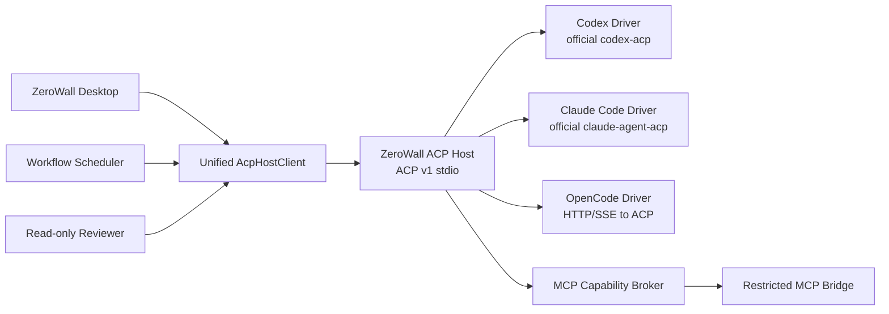

# ZeroWall Science x Wisp x ChatGPT Desktop: Unified ACP Host Workbench Plan

Status: approved implementation plan
Branch: `codex/single-acp-host-unified-workbench`
Baseline: `release/v0.3.9` plus the preserved ACP reliability commit
Scope: desktop-first Tauri application; web mode hides native-only controls

## 1. Product and architecture outcome

ZeroWall Science is a local-first, model-agnostic research workbench. The
desktop product must present one continuous agent experience while supporting
Codex, Claude Code, and OpenCode. The UI, workflow scheduler, reviewer, MCP
broker, and provenance layer must never choose a vendor-specific transport.

The transport boundary is one local ACP v1 stdio host:



Codex and Claude Code are launched only through their official ACP adapter
processes. OpenCode is not treated as an ACP agent: its HTTP/SSE protocol is
translated by an internal Host driver. OpenCode DTOs, URLs, events, and retry
semantics must not appear in React, the public SDK, workflow definitions, or
the persistence schema. This gives the application one protocol and one event
reducer without pretending that OpenCode supports capabilities it does not.

Every secret is represented by a keychain reference. The Rust host resolves
references at launch time; secrets never enter ACP launch DTOs, JavaScript,
SQLite, JSONL provenance, artifacts, logs, crash reports, or exports.

## 2. Verified Wisp patterns to port

Wisp's useful boundary is ACP Client plus an independent capability bridge:

- one ACP process per active frame/project binding;
- `initialize`, `session/new`, `session/resume`, `session/load`,
  `session/prompt`, `session/cancel`, permission response, mode/config, and
  close are explicit lifecycle operations;
- profile fingerprint and project root are checked before resuming;
- `toolCallId` is the stable correlation key for tools;
- child process stdout is protocol-only, stderr has a bounded buffer, and
  Windows processes run without a visible console window;
- MCP tools are exposed through an allow-listed bridge rather than direct
  access to the application's database or runtime objects;
- workflow steps depend on a vendor-neutral delegation request and can run
  independent read-only steps in parallel while serializing mutation steps;
- ACP review is isolated, read-only, time-limited, and reports `Unreviewable`
  when raw inspectable output is missing.

Do not copy Wisp's UI or claim that its `External` executor is implemented.
ZeroWall keeps its own React desktop surface and makes OpenCode translation an
explicit internal driver.

## 3. Host and driver contracts

### 3.1 Rust host surface

Add the Host control plane at:

```text
apps/desktop/src-tauri/src/acp_host.rs
apps/desktop/src-tauri/src/acp_host_driver.rs
apps/desktop/src-tauri/crates/zerowall-acp-host/
```

The public host contract is ACP v1 over local stdio. Internally, the driver
trait is:

```rust
trait AcpHostDriver {
    async fn initialize(&mut self, request: InitializeRequest) -> Result<InitializeResponse>;
    async fn new_session(&mut self, request: NewSessionRequest) -> Result<SessionState>;
    async fn resume_session(&mut self, request: ResumeSessionRequest) -> Result<SessionState>;
    async fn load_session(&mut self, request: LoadSessionRequest) -> Result<SessionState>;
    async fn prompt(&mut self, request: PromptRequest) -> Result<PromptResponse>;
    async fn cancel(&mut self, session_id: SessionId) -> Result<()>;
    async fn respond_permission(&mut self, request_id: String, option_id: Option<String>) -> Result<()>;
    async fn set_config(&mut self, request: SetConfigRequest) -> Result<SessionState>;
    async fn set_mode(&mut self, request: SetModeRequest) -> Result<()>;
    async fn close_session(&mut self, session_id: SessionId) -> Result<()>;
}
```

```rust
enum HostDriverKind { Codex, ClaudeCode, OpenCode }
struct CredentialRef { keychain_id: String }
```

The Host owns child process lifetime, hidden-window flags, bounded stderr,
backpressure, crash detection, capability declarations, session bindings, and
profile fingerprints. Unsupported capabilities must return an explicit error;
they must never be fabricated.

### 3.2 Codex and Claude Code drivers

The Codex driver launches the pinned `codex-acp` adapter and the Claude driver
launches the pinned `claude-agent-acp` adapter. Neither driver may execute a
normal vendor CLI or reuse a system login. Model, gateway, and API credentials
are resolved from ZeroWall's keychain and injected only into the child process
environment. Both drivers proxy text, thought, tool, plan, usage, permission,
question, cancellation, and diagnostic events into the Host event stream.

### 3.3 OpenCode HTTP/SSE driver

The OpenCode driver owns all HTTP/SSE details and maps only supported behavior:

| ACP operation | Internal OpenCode operation |
| --- | --- |
| initialize | Host and driver capability declaration |
| session/new | `POST /session` |
| session/load | history retrieval |
| session/resume | reuse when supported, otherwise explicit unsupported |
| session/prompt | session message request |
| session/cancel | abort endpoint |
| message/reasoning/tool | unified event stream |
| permission/question | ACP request and option response |
| usage | provider-reported token usage |
| model/config | provider, model, variant mapping |
| close | release session mapping |

Original OpenCode DTOs remain private to this driver. The existing sandbox,
Basic auth, and manual approval behavior is retained behind the Host.

## 4. Unified SDK and immutable bindings

Add the following public types and migrate all callers:

```ts
type AgentEngine = "codex" | "claude-code" | "opencode";

interface AgentBinding {
  engineId: AgentEngine;
  profileId: string;
  modelId: string | null;
  providerId: string | null;
  variant: string | null;
  projectRoot: string;
  profileFingerprint: string;
  resolvedAt: string;
}

interface AgentSession {
  id: string;
  acpSessionId: string | null;
  binding: AgentBinding;
  state: "new" | "ready" | "busy" | "waiting" | "error" | "closed";
  resumable: boolean;
}

type AgentEvent =
  | "session.started" | "session.idle" | "session.closed"
  | "text.delta" | "thought.delta" | "tool.updated" | "plan.updated"
  | "permission.requested" | "question.requested" | "usage.updated"
  | "artifact.created" | "error";
```

`packages/sdk/src/runtime.ts`, `types.ts`, `base-runtime.ts`,
`OpenCodeClient.ts`, `ZeroWallClient.ts`, the desktop runtime store, ACP
consumer, and Tauri bridge are migrated to `AcpHostClient`. React consumes
only `AgentEvent`; the old OpenCode event type remains temporarily as a
compatibility converter and is removed after migration. No public API may
expose OpenCode HTTP/SSE types.

The first prompt freezes engine, model, provider, variant, project root, MCP
allow-list, and Skills snapshot. A changed profile fingerprint or project root
cannot resume the old ACP session. Switching after the first message creates a
new session, optionally forking visible context; it never silently mutates the
old binding.

## 5. Engine and model selection

The composer always shows two independent selectors:

```text
引擎：Codex / Claude Code / OpenCode
模型：具体模型
```

`EnginePicker.tsx`, `ModelPickerPanel.tsx`, and `SelectionSnapshot.tsx` display
capabilities, availability, and the immutable snapshot. Before the first send,
both values can change. After the first send, a change offers new session,
fork-context, or cancel. Review uses the same two selectors in its own isolated
session.

## 6. MCP, Skills, and Workflow control plane

### MCP Capability Broker

The Rust broker resolves an allow-list and launches a restricted bridge with
server id, tool ids, project root, session id, and frame id only. States are
`available`, `starting`, `ready`, `deferred`, `needs-approval`, `error`, and
`disabled`. A failed optional MCP server must not block the main ACP session.
Mutation tools require explicit approval and are serialized through the
workflow mutation lane.

### Skills

Skills are addressed by `id`, `version`, `scope`, `sha256`, and manifest. Scope
is global, project, conversation, or workflow node. Discover core Skills by
default; load larger packs on demand into the project environment so their
descriptions do not consume the model context budget. The resolved Skill
snapshot is persisted with the session or workflow node.

### Workflow scheduler

All agent nodes call `AcpHostClient`; the scheduler does not branch on engine:

```text
Workflow Scheduler -> Delegation Request -> ZeroWall ACP Host -> Driver
```

Supported node kinds are `agent`, `tool`, `run`, `review`, and `artifact`.
Implement a durable DAG with dependency checks, parallel read-only nodes, a
serialized mutation lane, pause, cancel, retry policy, resume from completed
nodes, restart recovery, node-level binding/MCP/Skills snapshots, artifact
links, evidence coverage, and provenance. Built-in templates are literature
evidence review, paper search and deduplication, reproducible experiment, and
report generation.

## 7. Review and provenance

Reviewer runs use an independent ACP session, default read-only policy, and a
90-second timeout. Permission requests for writing, deleting, shell execution,
remote connections, and mutation MCP are automatically denied. A missing raw
inspectable output produces `Unreviewable`, never a false pass. Auto-fix is a
new user-approved action, not an implicit mutation. Persist engine, model,
coverage, timeout, evidence references, verdict, and diagnostics without any
credential material.

## 8. ChatGPT Desktop-style desktop UI

The target is a desktop workbench, not a mobile redesign. The first launch
screen is:

```text
ZeroWall Science
你的桌面科研工作台

登录   注册   先跳过
```

Unauthenticated users can use local models, custom providers, installed
OpenCode, MCP, Skills, and Workflows. User-visible provider wording is always
“AI 云平台”; internal vendor names never appear in product copy.

The shell contains a narrow left rail for New conversation, Search, Workflow,
Projects, and Settings. The main pane is a continuous transcript with compact
thinking, tool, permission, workflow, artifact, review, and usage cards. The
composer has attachment, MCP, Skills, Workflow, engine, model, and send
controls. Settings includes AI 云平台 account, custom providers, engines and
models, MCP, Skills, workflows, security, and updates. Preserve light/dark
themes, Chinese/English localization, keyboard navigation, and clear loading,
waiting, error, recovery, and offline states.

## 9. Account and custom provider management

The AI 云平台 flow supports login, registration, email verification, 2FA,
logout, expired-session recovery, model sync, balance, and usage. Credentials
are written only to the OS keychain. Local mode and “先跳过” remain usable.

Custom providers support OpenAI-compatible, Anthropic-compatible, and local
protocols. The form collects name, protocol, base URL, API key, model probe,
default model, and context window. Save is `validate -> endpoint probe -> model
discovery -> keychain write -> provider id + credential reference`. Running
sessions retain immutable snapshots when a provider is removed or rotated.

## 10. Split installers and independent updates

The application installer contains Tauri Host, React UI, SDK, ACP Host control
plane, workflow control plane, settings, and update manager. It does not carry
large runtimes.

The Environment Bootstrapper installs pinned ACP host/adapter binaries, Codex
and Claude runtimes, OpenCode runtime, Node, uv, agent-browser, MCP bridge, and
Skills packs under:

```text
appData/environment/versions/<version>/
appData/environment/current
appData/environment/staging/
```

Installation and environment updates use signed manifests, SHA-256 checks,
staging extraction, health probes, atomic `current` switching, retained old
versions, and automatic rollback. Application and environment channels have
independent state machines: `idle`, `checking`, `available`, `downloading`,
`verifying`, `installing`, `restart-required`, `failed`, and `rolled-back`.
The update dialog shows current/target version, component, progress, checksum,
restart requirement, failure reason, cancel, retry, and rollback. Updates are
blocked during agent turns, workflow runs, mutation MCP operations, or active
RunActivity. Resumable downloads and staging cleanup are required.

## 11. Execution phases and checkpoints

### P0: branch and baseline

Create the new branch from `release/v0.3.9`, preserve dirty state and untracked
assets externally, restore the approved ACP reliability commit, run baseline
frontend/Rust tests, and record the result in `PROGRESS.md`.

### P1: Host proof of concept

Add a fake ACP server and fake OpenCode HTTP/SSE server. Test host stdio,
initialize, new/load/resume, prompt, event order, text/thought/tool/plan/usage,
permission, cancel, backpressure, and crash recovery. Add Codex and Claude
adapter launch probes and OpenCode translation tests.

### P2: production Host

Implement Rust lifecycle management, hidden Windows processes, bounded stderr,
credential references, fingerprints, capability declarations, MCP broker, and
driver crash recovery. Add integration tests for missing adapters and denied
permissions.

### P3: runtime migration

Move the existing ACP consumer and OpenCode client behind the single Host
client, migrate the event reducer and persistence, and remove the dual frontend
runtime paths. Add compatibility migration for old sessions and settings.

### P4: capabilities

Deliver engine/model snapshots, MCP broker, Skills store, workflow scheduler,
artifact/provenance persistence, and isolated review.

### P5: desktop UI

Implement first-run auth/skip, ChatGPT Desktop shell, engine/model pickers,
settings, AI 云平台 account, custom providers, MCP, Skills, workflows, review,
and update dialogs. Validate the approved desktop sketch before polishing.

### P6: packaging and updates

Build the app installer and Environment Bootstrapper separately. Add signed
manifest, checksum, progress, cancellation, resume, atomic switching, restart,
rollback, and clean-machine install tests on Windows, macOS, and Linux.

### P7: migration and release

Migrate old ACP/profile/model settings without losing projects, sessions,
artifacts, or provenance. Run full security, compatibility, clean-install,
interrupted-update, rollback, and release-candidate tests.

## 12. Test and acceptance matrix

Each engine must pass `launch -> initialize -> new session -> prompt -> text ->
thought -> tool -> permission -> permission response -> artifact -> usage ->
complete -> cancel -> restore` through the same Host client. Failure tests cover
missing Host/adapter, unavailable OpenCode sidecar, unknown model, MCP timeout,
provider probe failure, network interruption, denied permission, Host crash,
invalid signature/checksum, disk exhaustion, cancelled update, rollback, stale
session isolation, and key rotation.

Security tests assert that API keys, tokens, and 2FA secrets are absent from
localStorage, SQLite, JSONL, workflow definitions, provenance, artifacts,
logs, crash reports, and exported archives. UI tests cover login, registration,
skip, engine/model selection, MCP, Skills, workflows, review, AI 云平台,
custom providers, update dialogs, themes, locales, permission wait, failure,
and recovery.

The implementation is accepted only when all three engines use one ZeroWall
ACP Host, React has one Host client and one AgentEvent path, OpenCode HTTP/SSE
is private to its driver, engine/model binding is immutable after first send,
MCP/Skills/Workflow/Review use the unified control plane, the desktop UI has no
internal vendor wording, app and environment packages update independently,
and existing user data and secrets remain safe.

## 13. Default assumptions and stop conditions

- The implementation branch is `codex/single-acp-host-unified-workbench`.
- The baseline is `release/v0.3.9`; current user ACP reliability changes are
  restored as an explicit commit.
- First release supports local stdio ACP only; remote ACP is deferred.
- Workflow agent nodes use the Host; compute nodes remain in the control plane.
- The first sent prompt freezes engine/model/provider/variant/MCP/Skills.
- Native-only controls are hidden in gateway web mode.
- Every phase has a failing-test, implementation, passing-test, and review
  checkpoint. A repeated verification failure or a missing external dependency
  stops the phase for explicit investigation rather than silently changing the
  architecture.
